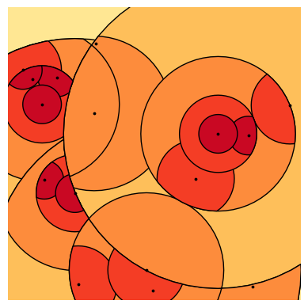
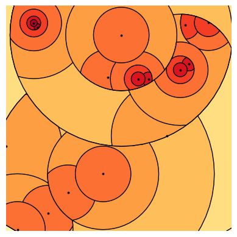
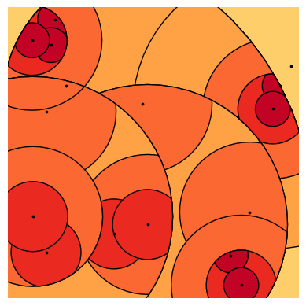
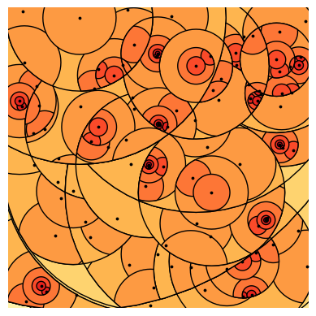

# TreeMetrics: 2D Spatial Data Clustering & Visualization

[cite_start]This project implements a hierarchical clustering approximation algorithm designed to process 2D spatial data. [cite_start]It was originally inspired by the algorithmic visualization from the cover of *[The Design of Approximation Algorithms](https://www.designofapproxalgs.com/book.pdf)* and further developed during my time at the Deep Learning Laboratory[cite: 18].

[cite_start]The core focus of this repository is generating custom geometric representations and dimensionality reduction visualizations using **NumPy** and **Shapely**.

## Visual Gallery
Here are a few examples of the geometric patterns generated by the algorithm:

## Tech Stack
* Python (Jupyter Notebook)
* NumPy
* Shapely

## Try it yourself!
The project is set up as an interactive Jupyter Notebook. Clone the repository and run the notebook to see what geometries the algorithm generates for you:

\`\`\`bash
git clone https://github.com/placikk/treemetrics.git
cd treemetrics
pip install numpy shapely jupyter
jupyter notebook demo.ipynb
\`\`\`
